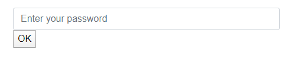
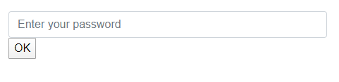

# BlazorAnimation

a Blazor component based on animate.css to easly animate your content


## Quick Start

To animate a component, wrap it inside Animation component and use the Effect parameter to define the animation:

```
     <Animation Effect="@Effect.BounceOutUp" Speed="@Speed.Fast">
        <h1>Hello, world!</h1>
    </Animation>
```

## Getting Started

Few steps are required in order to use the library.

#### Add NuGet

```csharp
Install-Package BlazorAnimation
```

#### Configure _Imports.razor

```
...
@using BlazorAnimation
```

#### Add JS interop into _Host.cshtml

```
   <script src="_content/BlazorAnimation/blazorAnimationInterop.js"></script>
```

#### If you notice any error in blazor wasm, add a configuration in program.cs
```
...
builder.Services.Configure<AnimationOptions>(Guid.NewGuid().ToString(),c=>{});
```

#### Use the Animation component

```
    <Animation Effect="@Effect.BounceOutUp" Speed="@Speed.Fast" Delay="@Delay.None" IterationCount="2">
        <h1>Hello, world!</h1>
    </Animation>
```

## Sample

For a sample, please view http://blazoranimation.boudoux.fr

## Parameters

Here's are the parameters to configure the component

|Parameter Name| Abstract  | Default |
|--|--|--|
| [Effect](https://github.com/aboudoux/BlazorAnimation/blob/master/README.md#effect) | Define the effect to use for animate the component. | @Effect.Bounce  |
| [Delay](https://github.com/aboudoux/BlazorAnimation/blob/master/README.md#delay) | The time to wait before the animation begin. | @Delay.None
| [Speed](https://github.com/aboudoux/BlazorAnimation/blob/master/README.md#speed) | The total animation duration. | @Speed.Slow
| [IterationCount](https://github.com/aboudoux/BlazorAnimation/blob/master/README.md#iterationcount) | the number of times the animation will be played. For an infinite loop, you can set a negative number. | 1
| [Enabled](https://github.com/aboudoux/BlazorAnimation/blob/master/README.md#enabled) | You can enable or disable the animation component by code with this parameters. Very convenient in certain situations| True
| [OnAnimationEnd](https://github.com/aboudoux/BlazorAnimation/blob/master/README.md#onanimationend) | Call a method when the animation end. | null

### Effect
Define the effect to use for animate the component.

You can use one of the 90 animations provided by the [animate.css class](https://animate.style/). Just use the `@Effect` into the `Effect` parameters to list them all.

Example
```
<Animation Effect="@Effect.Jello">
	<h1>Hello !</h1>
</Animation>
```   
### Delay
The time to wait before the animation begin.

You can use one of the 6 predefined delay by using the `@Delay` enumeration that contains :

- None
- OneSecond
- TwoSeconds
- ThreeSeconds
- FourSeconds
- FiveSeconds

Example :
```
<Animation Effect="@Effect.Jello" Delay="@Delay.OneSecond">
	<h1>Hello !</h1>
</Animation>
```   

Or just define your own time manualy with a `TimeSpan` like below :

Example with custom time :
```
<Animation Effect="@Effect.Jello" Delay="@TimeSpan.FromMilliseconds(250)">
	<h1>Hello !</h1>
</Animation>
```   

### Speed

the total time of the animation from the time when the delay has elapsed.

You can use one of the 4 predefined speed by using the  `@Speed`  enumeration that contains :

-   Slow (2s)
-   Slower (3s)
-   Fast (800ms)
-   Faster (500ms)

```
<Animation Effect="@Effect.Jello" Speed="@Speed.Fast">
	<h1>Hello !</h1>
</Animation>
```  
Or just define your own time manualy with a `TimeSpan` like below :

Example with custom time :
```
<Animation Effect="@Effect.Jello" Speed="@TimeSpan.FromSeconds(1)">
	<h1>Hello !</h1>
</Animation>
```
### IterationCount
the number of times the animation will be played. For an infinite loop, you can set a negative number.

Example :
```
<Animation Effect="@Effect.Jello" IterationCount="5">
	<h1>Hello !</h1>
</Animation>
```
Exemple with infinite loop :
```
<Animation Effect="@Effect.Jello" IterationCount="-1">
	<h1>Hello !</h1>
</Animation>
```

> Notice that an IterationCount defined to 0 do not play the animation.

### Enabled
Provide a way to enable or disable animation by code. This can be useful for certain scenarios like animating based on events (mouse, keyboard, ...) or to react to actions in a flux architectural pattern.

Example
```
<Animation Effect="@Effect.BounceOutUp" Enabled="RunAnimation">
	<h1 @onmouseover="MouseOver" @onmouseout="MouseOut">Hello, world!</h1>
</Animation>

@code{

    private bool RunAnimation = false;
    private void MouseOver() => RunAnimation = true;
    private void MouseOut() => RunAnimation = false;
}
```

### OnAnimationEnd
Call a method when the animation end.

Example
```
 <Animation Effect="@Effect.BounceOutUp" Enabled="RunAnimation" Speed="@Speed.Slower" OnAnimationEnd="AnimationEnd">
     <h1 @onmouseover="MouseOver" >Hello, world!</h1>
 </Animation>

@code{

    private bool RunAnimation = false;
    private void MouseOver() => RunAnimation = true;
    private void AnimationEnd() => RunAnimation = false;
}
```
This property can be accessed with ```CascadingValue```

For example, imagine you create an ```InputPassword``` component like this :
```
    <Animation Effect="@Effect.Shake" Speed="@Speed.Fast" Enabled="@Shake">
        <input type="password" class="form-control" @bind-value="@Password" placeholder="Enter your password" />
    </Animation>

@code {

    [Parameter]
    public bool Shake { get; set; }
    public string Password { get; set; }
}
```
and you use it in a page :

```
<InputPassword @ref="inputPassword" Shake="NotifyBadPassword" />
<button @onclick="OkClicked">OK</button>

@code {
    InputPassword inputPassword;
    bool NotifyBadPassword = false;
    private void OkClicked()
    {
        if (inputPassword.Password != "test")
            NotifyBadPassword = true;
    }
}
```
The expected behavior is to shake the input when the password is wrong. But when you run the application, you notice that the animation run only the first time.



The best way to resolve this issue is to pass the ```NotifyBadPassword ``` to false when the animation end. This can be achieved with a cascading value like this :

```
<CascadingValue Name="OnAnimationEnd" Value="@EventCallback.Factory.Create(this,AnimationEnd)">
  <InputPassword @ref="inputPassword" Shake="@NotifyBadPassword" />
</CascadingValue>
<button @onclick="OkClicked">OK</button>

@code {
	InputPassword inputPassword;
	bool NotifyBadPassword = false;

	private void OkClicked()
	{
	    if (inputPassword.Password != "test")
	        NotifyBadPassword = true;
	}

	private void AnimationEnd()
	{
	    NotifyBadPassword = false;	    
	}
}
```


## Named configurations

BlazorAnimation supports named animation settings through the ASP.NET Core's named options. Here's an example where two configurations are provided, one without a name (the defaults) and one with a name:

```
services.Configure<AnimationOptions>("bounce", o =>
{
	o.Effect = Effect.BounceInLeft;
	o.Speed = Speed.Faster;
	o.Delay = TimeSpan.FromMilliseconds(200);
	o.IterationCount = 2;
});

services.Configure<AnimationOptions>(o => {
	o.Effect = Effect.FadeOutDown;
	o.Speed = Speed.Slow;
});
```

To use a named configuration, provide the OptionsName parameter:

```
<Animation OptionsName="bounce">
    <h1>Hello, world!</h1>
</Animation>
```
## Authors

BlazorAnimation is created by [Aurelien BOUDOUX](http://aurelien.boudoux.fr).

Contributions are welcome!

## License

BlazorAnimation is MIT licensed. The library uses the following other libraries:

* [Animate.css](https://github.com/daneden/animate.css): MIT-license

## ChangeLog

7 may 2020 - v2.0.0 : Upgrade to animate.css v4