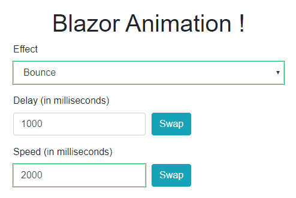

# BlazorAnimation
a Blazor component based on animate.css to easly animate your content




## Quick Start

To animate a component, wrap it inside Animation component and use the Effect parameter to define the animation:

```
     <Animation Effect="@Effect.BounceOutUp" Speed="@Speed.Fast">
        <h1>Hello, world!</h1>
    </Animation>
```

## Getting Started

Few steps are required in order to use the library.

#### Add NuGet

```csharp
Install-Package BlazorAnimation
```

#### Configure _Imports.razor

```
...
@using BlazorAnimation
```

#### Add JS interop into _Host.cshtml

```
   <script src="_content/BlazorAnimation/blazorAnimationInterop.js"></script>
```

#### Use the Animation component

```
    <Animation Effect="@Effect.BounceOutUp" Speed="@Speed.Fast" Delay="@Delay.None" IterationCount="2">
        <h1>Hello, world!</h1>
    </Animation>
```

## Sample

For a sample, please view http://blazoranimation.boudoux.fr

## Parameters

Here are the parameters to configure to use the component

|Parameter Name| Abstract  | Default |
|--|--|--|
| [Effect](https://github.com/aboudoux/BlazorAnimation/blob/master/README.md#effect) | Define the effect to use for animate the component. | @Effect.Bounce  |
| [Delay](https://github.com/aboudoux/BlazorAnimation/blob/master/README.md#delay) | The time to wait before the animation begin. | @Delay.None
| [Speed](https://github.com/aboudoux/BlazorAnimation/blob/master/README.md#speed) | The total animation duration. | @Speed.Slow
| [IterationCount](https://github.com/aboudoux/BlazorAnimation/blob/master/README.md#iterationcount) | the number of times the animation will be played. For an infinite loop, you can set a negative number. | 1
| Enabled | You can enable or disable the animation component by code with this parameters. Very convenient in certain situations| True
| OnAnimationEnd | Call a method when the animation end. | null

### Effect
Define the effect to use for animate the component.

You can use one of the 77 animations provided by the [animate.css class](https://github.com/daneden/animate.css#animations). Just use the `@Effect` into the `Effect` parameters to list them all.

Example
```
<Animation Effect="@Effect.Jello">
	<h1>Hello !</h1>
</Animation>
```   
### Delay
The time to wait before the animation begin.

You can use one of the 6 predefined delay by using the `@Delay` enumeration that contains :

- None
 - OneSecond
 - TwoSeconds
 - ThreeSeconds
 - FourSeconds
 - FiveSeconds

Example :
```
<Animation Effect="@Effect.Jello" Delay="@Delay.OneSecond">
	<h1>Hello !</h1>
</Animation>
```   

Or just define your own time manualy with a `TimeSpan` like below :

Example with custom time :
```
<Animation Effect="@Effect.Jello" Delay="@TimeSpan.FromMilliseconds(250)">
	<h1>Hello !</h1>
</Animation>
```   

### Speed

the total time of the animation from the time when the delay has elapsed.

You can use one of the 4 predefined speed by using the  `@Speed`  enumeration that contains :

-   Slow (2s)
-   Slower (3s)
-   Fast (800ms)
-   Faster (500ms)

```
<Animation Effect="@Effect.Jello" Speed="@Speed.Fast">
	<h1>Hello !</h1>
</Animation>
```  
Or just define your own time manualy with a `TimeSpan` like below :

Example with custom time :
```
<Animation Effect="@Effect.Jello" Speed="@TimeSpan.FromSeconds(1)">
	<h1>Hello !</h1>
</Animation>
```
### IterationCount
the number of times the animation will be played. For an infinite loop, you can set a negative number.

Example :
```
<Animation Effect="@Effect.Jello" IterationCount="5">
	<h1>Hello !</h1>
</Animation>
```
Exemple with infinite loop :
```
<Animation Effect="@Effect.Jello" IterationCount="-1">
	<h1>Hello !</h1>
</Animation>
```

> Notice that an IterationCount defined to 0 do not play the animation.

... to be continued
